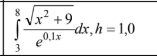
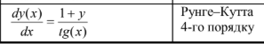

ОБЧИСЛЮВАЛЬНІ АЛГОРИТМИ
ЛАБОРАТОРНА РОБОТА 2.1

ДОСЛІДЖЕННЯ МАТЕМАТИЧНИХ АЛГОРИТМІВ

Мета – дослідження числових методів розв’язання математичних залежностей та набуття практичних навичок реалізації цих методів для обчислення значення інтеграла, коренів алгебричних рівнянь і числового інтегрування диференційних рівнянь.

Завдання першого рівня
Виконати такі дії:
– обчислити значення інтеграла для заданої інтегральної функції, інтервалу та кроку згідно з варіантом завдання (дод. 7,
табл. Д7.1), використовуючи методи трапецій, прямокутників та Сімпсона.

Завдання другого рівня
Виконати такі дії:
– знайти корені алгебричного рівняння згідно з варіантом завдання (дод. 7, табл. Д7.2) на певному інтервалі, використовуючи методи половинчастого ділення, дотичних та хорд.

Завдання третього рівня
Виконати такі дії:
– розв'язати диференціальне рівняння 1-го порядку методом згідно з варіантом завдання (дод. 7, табл. Д7.3) з обов’язковим завданням початкових умов.

Методичні рекомендації
Початкові дані для виконання завдання першого рівня (інтервал та крок), другого рівня (інтервал) і третього рівня (початкові умови, кінцеве значення аргументу, крок) необхідно вводити з клавіатури

Для демонстрації результатів виконання завдання другого рівня слід обирати інтервали, що містять один корінь, декілька коренів або не містять жодного кореня.

Результат виконання завдання третього рівня потрібно вивести у вигляді таблиці, де перший стовбчик – значення аргумента (х), а друга – значення функції (y).

Інтеграл та крок інтегрування

Функція y(x)
2x - 3 • sin(2x) - 1

